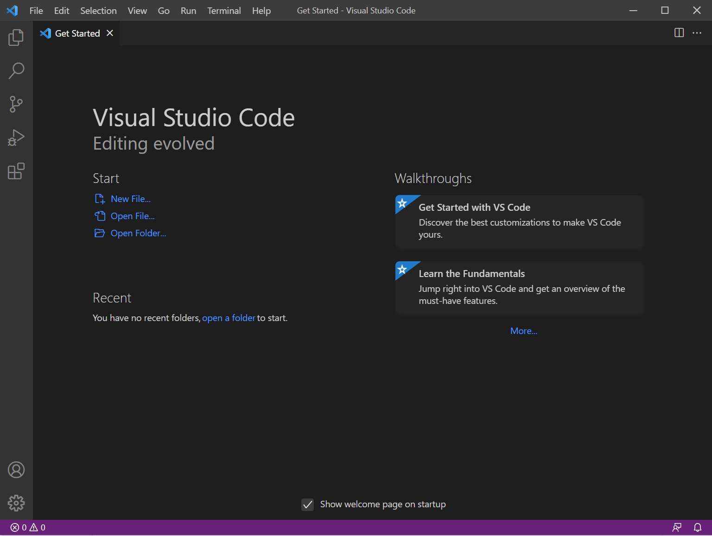

[Back to Index](index.html)

# Lab Report 1 Week 2

## Getting Started With VSCode

In this write-up I will be giving a tutorial to new CSE 15L students on how to set up and get started with VSCode and ieng6.

---

**Step 1: Installing VSCode**

This is likely the easiest step in the whole process. Download the correct version of VSCode for your PC and OS from this [link](https://code.visualstudio.com/download). Agree to the appropriate terms and conditions and install and launch VSCode. When you are done it should have a screen that looks like this:



---

**Step 2: Remotely Connecting to ieng6**

If you are on Windows, you will need to install OpenSSH on your PC. Open Settings -> Apps -> Apps & Features-> Optional Features. First, search if OpenSSH Client and OpenSSH Server are installed on your computer. If not, click "Add Feature" and install the two apps. 

Next, obtain your UCSD CSE 15L account ID from this [link](https://sdacs.ucsd.edu/~icc/index.php). To activate it, you will need to globally reset your password on your UCSD Active Directory. This will take 15-20 minutes after resetting to activate.

Next, open a new terminal in VSCode. You can do this with the command Terminal -> New Terminal or Ctrl or Command + `. Then, type the command ```ssh (yourUCSDcse15laccountID)@ieng6.ucsd.edu```. Hit enter. It will ask you if you want to continue connecting after the authenticity of the host can't be established. Type ```yes``` and hit enter again. It will ask you for your password. So far the steps should look like this: 


After you enter your password, the login to ieng6 should look like this:


At this point you are logged in to ieng6, a remote UCSD computer.

---

**Step 3: Trying Out Some Commands**

Now that you are logged in remotely, you should be able to try various different commands in the command line. Feel free to experiment! Some useful commands are: ```cd```, ```cd ~```, ```ls -a```, ```ls -lat```, and more. I have included an image of what ```ls -a``` looks like below.


---

**Step 4: Moving Files with scp**

Now we will go over how to move local files to ieng6. This is useful for a variety of reasons from using ieng6's computing power to having a remote save of your files. The key portion of this step is to enter the command ```scp``` when you are in the working directory where the file you want to move is located. When you are in the directory (use "cd" command), type the ```scp``` command in the following format: ```scp (fileName).java (cs15laccount)@ieng6.ucsd.edu:~/```. Typing this command will prompt you for your password. Enter the password and it should show an upload report. I have included an example below where I upload a Java file and then compile and run it on ieng6.


---

**Step 5: Setting Up an SSH Key**

This portion will allow you to set a private SSH key on your pc and a public SSH key on ieng6 so you will not have to enter your password every time to run commands on ieng6. 

First, run the command ```ssh-keygen``` in terminal. It should give you a message similar to this:


It will ask you for a passphrase. Hit enter to set no passphrase. This means a private and public key were just created in your .ssh folder in your User directory. The public key should have ".pub" at the end of the file name. At this point, you do not need to do anything with the private key. We will now upload the public key to your ieng6 account. To do this, run the following commands in order:

1. Log in to ieng6 with ssh as before and enter password.
2. Run command ```mkdir .ssh```
3. Enter ```exit``` command.
4. Run command ```scp /Users/joe/.ssh/id_rsa.pub cs15lwi22@ieng6.ucsd.edu:~/.ssh/authorized_keys```. Note that you should use your personal User directory, private key name, and ieng6 account.

You should now be able to log into ieng6 via ssh and run scp without having to enter your password. Here is an image of what this looks like:


---

**Step 6: Optimizing Remote Running**

There is nothing to actually set up in this step, but some helpful tips are here.

You can write a command to be run on ieng6 without logging in directly on your terminal by using the following format:
```ssh cs15lwi22@ieng6.ucsd.edu "(command name)"```

Assuming you have SSH keys set up, you don't even need to enter your password for this to run on ieng6. Note that as soon as the command finishes, it will log you out.

You can use semicolons to run multiple commands on the same line. Make sure to include your commands in the quotes if you want them all to run on ieng6.

Here's a picture of what implementing these two techniques at the same time looks like:


Now, let's do a comparison of how many keystrokes this just saved us. The command entered in the image above has 40 keystrokes, including hitting the "Enter" key to run the command. If we were to log in to ieng6 and run these commands separately, the total number of keystrokes would be 43, including the ```exit``` command to log out. This just saved us 3 keystrokes. This doesn't sound like a lot but it adds up over the course of a long project. In short, using the quotes to run ssh commands remotely does save keystrokes. Now let's take a look at how many keystrokes the semicolon saved us. The command in the image above has 40 keystrokes. If we were to enter ```ssh cs15lwi22@ieng6.ucsd.edu "ls -a"``` and ```ssh cs15lwi22@ieng6.ucsd.edu "ls"``` separately, that's a total of 71 keystrokes! Now, suppose we had a passphrase on our ssh key instead of no passphrase. Let's say this passphrase is x characters long. This would be 71+2x keystrokes since we would have to enter our passphrase an additional time, as opposed to 40+x keystrokes. The command in the picture just saved 31+x keystrokes. That adds up very fast over time! Using the two techniques listed above together will save a lot of keystrokes in the long run.

---

Closing Message

I hope you are now set up with VSCode and ieng6. Many students struggle their first time in this process and that's ok. We will dive deeper into the applications of ieng6 as move further into the course.

