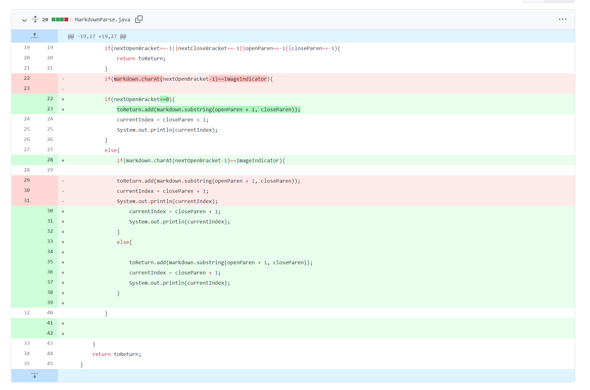
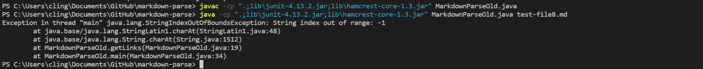

[Back to Index](https://clingunis.github.io/cse15l-lab-reports/index.html)

# Lab Report 2 Week 4

## Debug Code Change #1

Code Change:

Failure-inducing Input File:

[Link to the file](https://raw.githubusercontent.com/clingunis/markdown-parse/main/test-file2.md)

Symptom Screenshot:

Description:

The failure-inducing input was a file with an image attachment. The symptom was that it returns the name of the image file along with the links in the list of links. We expect only links and not image file names. 
The bug is that our code did not account for the similar format of images and links, since images follow a similar bracket and parentheses syntax as links but with a '!' character before. This bug causes the program to detect image file names in the parentheses for image files and print them as a part of the link list, when we expect the program not to. The code change makes it so the program accounts for if there is a '!' character before the first open bracket and does not add the content between the parentheses to the list of links to return if there is a '!' character before the first open bracket.

---

## Debug Code Change #2

Code Change:

Failure-inducing Input File:

[Link to the file](https://raw.githubusercontent.com/clingunis/markdown-parse/main/test-file3.md)

Symptom Screenshot:

Description:

The failure-inducing input was a file with characters after the last link. The symptom was that the program threw an IndexOutOfBoundsException and crashed. The bug was that nextOpenBracket, nextCloseBracket, openParen, and closeParen were being set to -1, and other subsequent negative values, and would try to return a substring using this index. The program did not account for characters after the last link in the failure-inducing input and was setting variables nextOpenBracket, nextCloseBracket, openParen, and closeParen to -1 and other negative values because it could not find another link. This was causing the IndexOutOfBoundsException to be thrown when trying to generate a substring to add to the list of links. The change to the code makes it so that the program does not try to generate a substring, nor add a link, if any of the four variables mentioned previously are -1. This causes the program to produce the expected output and not throw any exceptions.

---

## Debug Code Change #3

Code Change:

Failure-inducing Input:

[Link to the file](https://raw.githubusercontent.com/clingunis/markdown-parse/main/test-file8.md)

Symptom Screenshot:

Description:

The failure-inducing input was a file with a link at the first character. The symptom was an IndexOutOfBoundsException and the program crashing. The bug was that the program was trying to look for the image indicating character '!' at index -1. The previous implementation of the code block that handled the printing image file names bug simply checked the character at nextOpenBracket-1. However, in a file where nextOpenBracket is the first character nextOpenBracket is 0 and the program tries to search for the '!' character at index -1, which doesn't exist. This causes the program to throw an IndexOutOfBoundsException and crash. The code change makes it so that the program does not check for the image indicating character '!' if nextOpenBracket=0 (at the first character).

---
