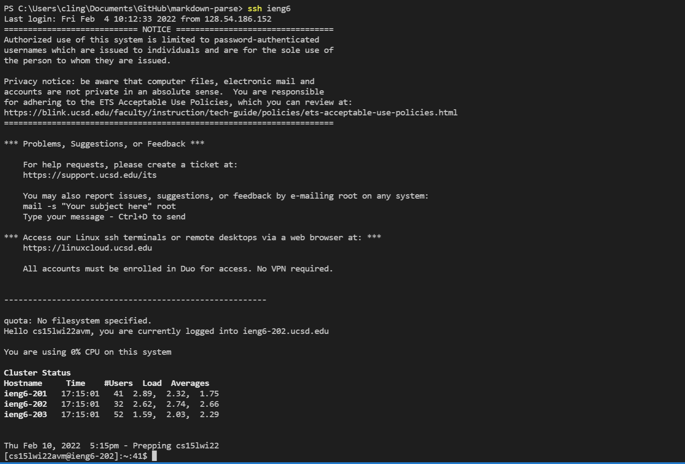

[Back to Index](https://clingunis.github.io/cse15l-lab-reports/index.html)

# Lab Report 3 Week 6

## Background

For this lab report I have chosen to do Group Task 1 from Week 5 Lab: Streamlining ```ssh``` Configuration. I have included the below the three required screenshots as well as a brief description for each.

---

## Screenshot 1


This is a picture of where my ```.ssh/config``` file is located along with the software I used to edit it. I used Notepad to edit the file and I've displayed the edited contents of the file in Notepad. I realize I could have edited this with VSCode but Notepad is the default option for my PC.

---

## Screenshot 2


This is a picture of me logging in with my new alias, called ieng6, for my ieng6 account. I've used the ```ssh``` command for this task.

---

## Screenshot 3


This is a screenshot of me using ```scp``` on my client terminal, after exiting my ieng6 account, to copy a file over to my ieng6 account using my new alias. Afterwards, I've used the ```ssh ieng6 "ls"``` command to print the contents of the directory and make sure the file is there and copied successfully. There are some other files located in that directory, but those are not relevant for this task. The important part is that MarkdownParse.java is there, which was not there before.