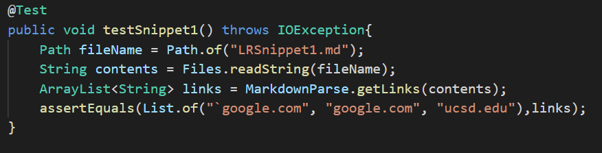
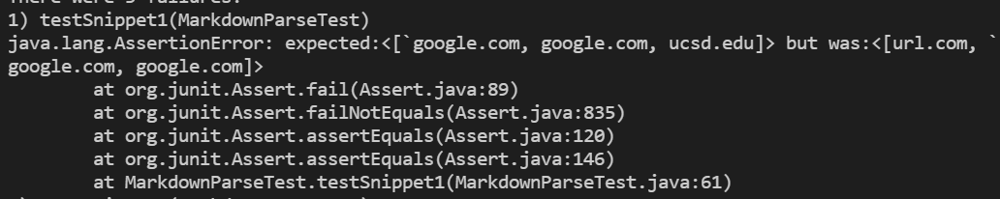
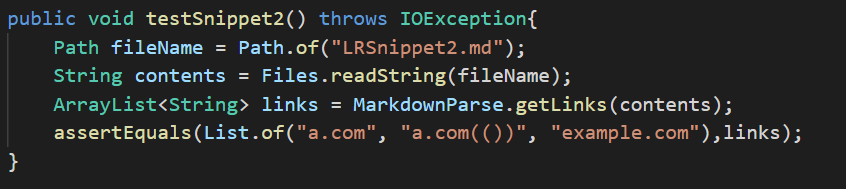
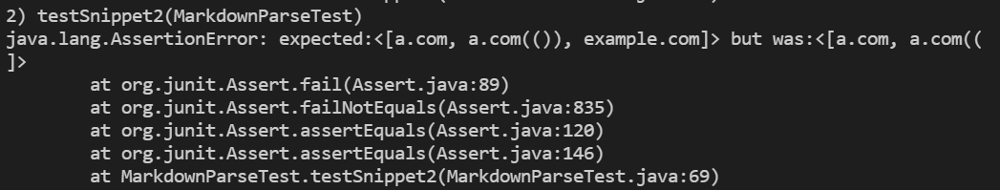
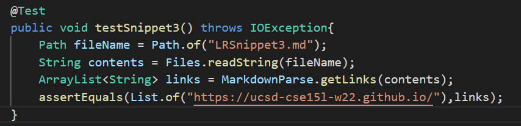
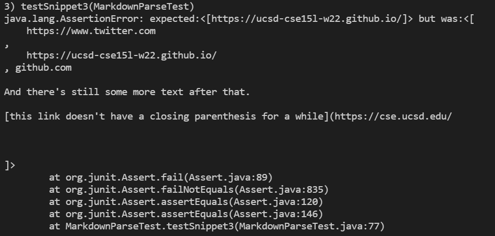
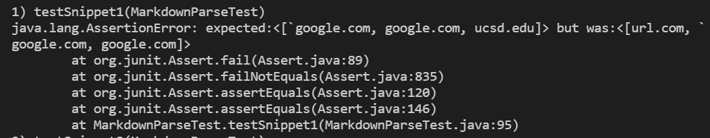
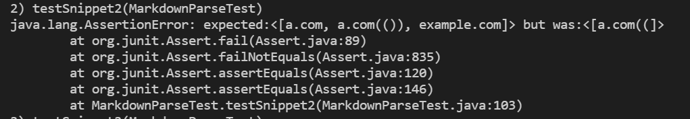
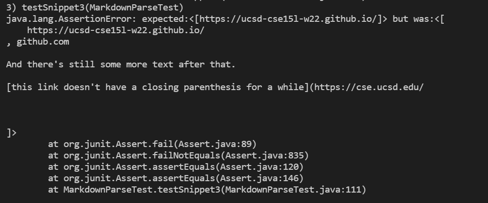

[Back to Index](https://clingunis.github.io/cse15l-lab-reports/index.html)

# Lab Report 4 Week 8

## Background

For this lab report I will be analyzing the output for my MarkdownParse as well as the MarkdownParse of the group I reviewed for three markdown code snippets. The three markdown code snippets are provided on the [course website](https://ucsd-cse15l-w22.github.io/week/week8/#week-8-lab-report).

Here are the links to the two MarkdownParse repositories I will be analyzing the output for:

[My MarkdownParse Repo](https://github.com/clingunis/markdown-parse)

[The Repo of the Group I reviewed (Platypus) ](https://github.com/nseyoum/CSE15L-Platypus)

---

## Expected Output

---
The expected output for each of the three snippets should be the same for both my MarkdownParse and the MarkdownParse of the group I reviewed.
## Snippet #1
Based on the [CommonMark demo site](https://spec.commonmark.org/dingus/), for snippet #1 we should expect an output of ```["`google.com", "google.com", "ucsd.edu"]```. According to the site, code blocks within brackets should be valid for links whereas code brackets that extend outside the brackets are not valid for links. According to the site, links should also allow backticks in the parentheses and brackets inside the main open bracket and close brackets.

## Snippet #2
Based on the [CommonMark demo site](https://spec.commonmark.org/dingus/), for snippet #2 we should expect an output of ```["a.com", "a.com(())", "example.com"]```. According to the preview on the site, for a link nested within the brackets of another link, the inner link should be considered a link but the outer link should not be considered a link. Links with parentheses within the main set of parentheses should be allowed. Brackets with escape sequences inside the main pair of brackets should also be allowed.

## Snippet #3
Based on the [CommonMark demo site](https://spec.commonmark.org/dingus/), for snippet #3 we should expect an output of ```["https://ucsd-cse15l-w22.github.io/"]```. According to the website output, line breaks (newline directly after another newline) should not be allowed in the main pair of brackets, nor in the main pair of parentheses. Links that have no closed parentheses should also not be considered links and should not interfere with the parsing of other links.

---

## My MarkdownParse Tests

---
## Snippet #1

How I made the test:


My Output:



The JUnit test did not pass because my code did not have a check for back ticks inside/outside the main pair of brackets. It also failed because my current code does not allow brackets inside of the main brackets; it parses until it finds the first close bracket. 

These two issues will each involve their own code changes and will not be small. I may have to implement a stack that pushes and pops brackets to deal with the nested brackets. For the back ticks, I could try checking for the last open back tick and seeing if the current openBracket is within the code block. But this check will likely introduce other problems.

## Snippet #2
How I made the test:


My Output:


The JUnit test did not pass because my code does not allow for nested parentheses nor brackets, it stops the link at the first close parenthesis. 

As stated before, this would likely be a more involved fix that involves either creating a stack to push and pop brackets or parentheses or rewriting nextCloseParen and nextCloseBracket to find the last close parenthesis/close bracket before the next open one, but that introduces a whole host of new checks and problems.

## Snippet #3
How I made the test:


My Output:


The JUnit test failed for two reasons. The first reason is that there is no check for line breaks in either the bracket or parentheses pair. 

This is a relatively simple fix. I can add a check that sees if there is any white space in the parentheses after the first and last newlines and if there is any additional newlines at the start and end of the link. For the brackets, I can check to see if there are two newline characters in a row at any point. If either of these are true, the link is not added. The second reason the test fails is that the program keeps parsing after an openParen with no closeParen even after line breaks until the next closeParen is reached. There is a simple fix for this as well. I can add an if check to see if there are any line breaks or if the file ends between the openParen and closeParen. If so, currentIndex is updated to openParen+1.

---

## My Reviewed Group's MarkdownParse Tests

---
## Snippet #1
How I made the test:


The Output:


## Snippet #2


The Output:


## Snippet #2


The Output:


---

