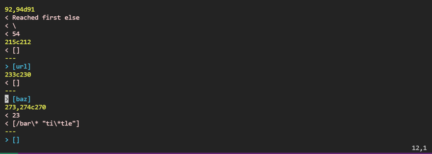
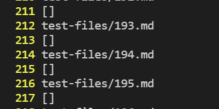
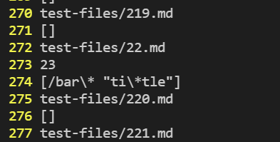
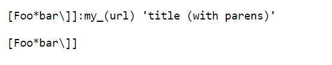
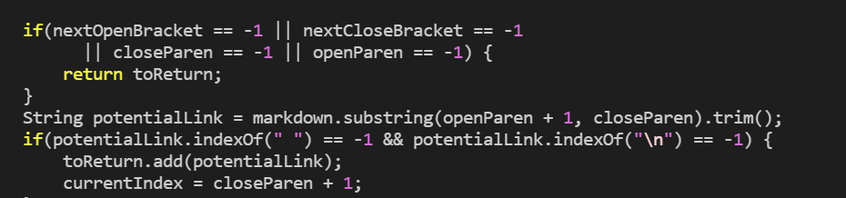
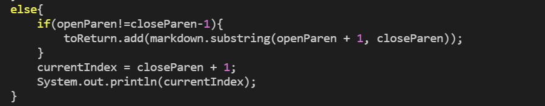

[Back to Index](https://clingunis.github.io/cse15l-lab-reports/index.html)

# Lab Report 5 Week 10

## Introduction

In this lab report I will be comparing the output my lab group's implementation of MarkdownParse against the output of the MarkdownParse implementation provided to us in Week 9's Lab. Specifically, I will examine two tests that had different output, analyze which one I believe to be the correct output, indicate the correct output, and finally suggest a possible fix to the code of the incorrect implementation.

---

## Finding Test Files with Different Output

In order to find two test files with different output, I did not go manually through the 652 test files. Instead I ran a bash script to run my group's implementation of MarkdownParse for every file with the extension `.md` in `test-files`. I then wrote a similar bash script for the implementation of MarkdownParse provided to us in Week 9 Lab. Both script files ran and stored the output in separate text files, each called `results.txt` these files were in different directories. I then ran the diff command to find the differences in output between these two files and output it to a file named `diff.txt`. The entire diff output is long and most of it is not necessary for this lab report. I will include a screenshot of the relevant output below.

In this difference file, the output listed first in pink is the output for my group's implementation of MarkdownParse. The output listed second in blue is the different output of the implementation of MarkdownParse provided to us. As one can see from the output, two notable differences in output (not just print statements from MarkdownParse for debugging purposes) occur at lines 215 and 273 of the `results.txt` file for my group's implementation of MarkdownParse. If we go into this `results.txt` file using vim, we can see that line 215 corresponds to test file `194.md` and that line 273 corresponds to test file `22.md`. I will include a screenshot of these lines in the vim of `results.txt` below.

These are the two different sets of test outputs I will analyze, the outputs test file `194.md` and `22.md`.

---

## File `194.md` Output

As we can see from `diff.txt`, the output for my group's implementation of MarkdownParse (which I will now refer to as MDParse for simplicity) was `[]` or an empty list. For the implementation of MDParse provided to us, the output was `[url]`. To examine which one is correct, we must take a look at the input file itself. The contents of `194.md` are:

Based on this input and the commonmark specifications, we should not expect any links since the first line has character in between the last close bracket and the first open parenthesis, which is not allowed for links. The only other pair of parentheses comes after several characters after the first set of parentheses, and the only other pair of brackets is on the second line with no parentheses following it. Both of these extra input characteristics should not form a link. Thus the expected output is: `[]`. Thus, based on the output in `diff.txt`, my group's implementation has the correct output of `[]` whereas the implementation provided to us incorrectly outputs `[url]`. `url` should not be included since characters come between the parentheses containing it and the corresponding open bracket.

As for a possible fix, I think that the bug is occurring not because of a specific portion of code, but rather the lack of a specific portion of code. There is no segment in the MDParse provided to us that checks if `nextCloseBracket` is directly before `openParen`. Since there is no segment of code that needs to be changed, I will include a picture of where I would insert the new code, rather than a picture of the code that needs to be changed.

To fix the bug, right after the first  `if` block in this picture, I would add an `if` block that checks `if (openParen==nextCloseBracket+1)` then set `currentIndex` to be equal to `closeParen` and then use `continue` to continue the while loop again. This is the fix I offer for this bug.

---

## File `22.md` Output

As we can see from `diff.txt`, the output for my group's implementation of MDParse was `[/bar\* "ti\*tle"]` whereas the output for the implementation provided to us was `[]`. To examine which one is correct, we must take a look at the input file itself. The contents of `22.md` are:

Based on this input and the commonmark specifications, we should expect the output for this file to be an empty list or `[]` because whitespace is not allowed within the text of links. While the input of this file follows the format of a proper link in every other aspect, the fact that there is a space character after the asterix makes this an invalid link. Thus, the expected output is `[]`. Thus, based on the output in `diff.txt`, my group's implementation has the incorrect output of `[/bar\* "ti\*tle"]` whereas the implementation provided to us correctly outputs `[]`.

As for a possible fix, I once again think the bug is not due to a specific portion of existing code, but rather the lack of code. There is no segment in my group's implementation that checks to see if there is whitespace in the text of the link. Since there is no segment of code that needs to be changed, I will include a picture of where I would insert the new code, rather than a picture of the code that needs to be changed.

To fix the bug I would add a String variable (which I will call `potentialLink` that is equal to `markdown.substring(openParen+1, closeParen).trim()`. Then I would add an `if` block right after the beginning of the `else` block, containing the `if` block in the picture that checks if `potentialLink.indexOf(\n)==-1 && potentialLink.indexOf(" ")==-1 && ...` for every whitespace character. Essentially, only if no whitespace is found in the potential link after it is trimmed, it is added to `toReturn`. Otherwise it would set `currentIndex` equal to `closeParen+1` and use `continue` to continue the loop. This would fix the current issue with this input file.

---

## Conclusion

That concludes the end of my analysis and comparison of the implementation of MDParse and their output for two significant test files. This is the final lab report I will be writing for this quarter. I wish you, the reader, best!